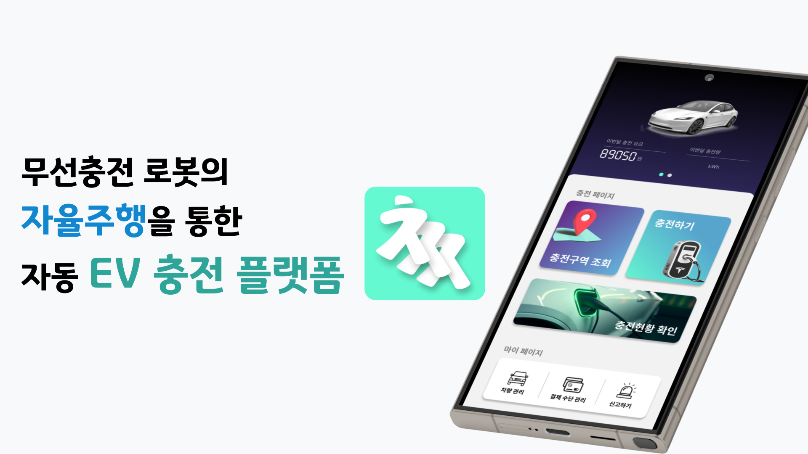
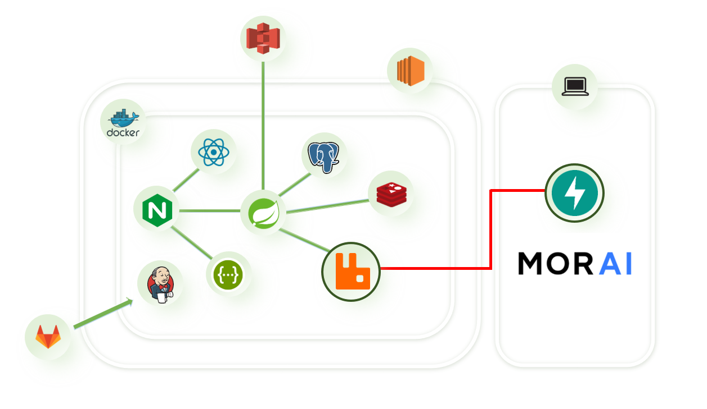

### 프로젝트명
---
차지직(CHAZzk)
전기차 인프라를 위한 자율주행 충전로봇 서비스

### 기간 / 인원
---
2024.08.19 ~ 2024.10.11, 6명

김송은: PM, 자율주행 판단 제어 기능 구현

김채민: QA, 자율주행 인지 측위기능 구현

이택규: A* 알고리즘 적용, SIM CustomMap 제작

강효린: FE 개발 팀장, 앱디자인 UX/UI 

최재원: BE 개발 팀장, 인프라 구축

지예찬: BE 개발, 엔티티 구현

### 개       요
---

전기차 충전시설 독점, 방해 문제와 주차공간 통일로 주차 효율 증가를 위한 전기차 충전로봇

무선충전 로봇의 자율주행을 통한 자동 EV 충전 플랫폼

### 기술 / 환경
---

기술1 - Unity 기반 주차장 맵 제작

기술2 - 자동 충전
자율주행 (Mapping, Path Planning, 주행) 기능 실현

기술3 - OCR
명암 재분배, 전기차 번호판 영역 추출

기술4 - 예약 스케쥴링
먼저 예약한 이용자 우선 충전, 충전로봇 유휴시간 최소화

기술5 - TDD
Jacoco 를 이용한 테스트 커버리지 측정

### 구현   사항
---

1. 앱을 통한 충전 예약 : 주차공간 입력 후 간편 충전 예약

2. 충전로봇 자율주행 : 최적경로 주행 장애물 회피 주행

3. 충전로봇 관리 관리자 페이지 : 실시간 충전로봇 현황 파악 신고 접수 확인

### 아키텍처 구조도
---

### 기술   스택
---
FE: React.js, Recoil, PWA

BE: SpringBoot, FastAPI, SpringSecurity, Spring Data JPA, OAuth2, JWT, Rabbit MQ, Junit5, Mockito, jacoco 

DB: PostgreSQL, Redis 

Infra: Ubuntu 20.04, Docker, Jenkins

EM : MORAI SIM, ROS2, Unity

### 최종발표자료

