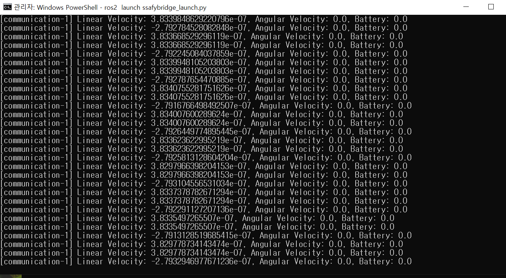

# 시뮬레이터와 통신하는 노드 만들기

## 1. 환경세팅

- ssafy_bridge, ssafy_msgs 패키지 : 시뮬레이터와 통신하기 위한 패키지
- 시뮬레이터 네트워크 세팅


### 2. **노드 작성**

- 시뮬레이터와 통신할 노드 작성
- `my_package` 에 [`communication.py`](http://communicaion.py) 노드 추가

`communication.py` 시뮬레이터에서 데이터를 수신하고, `rqt`에서 확인할 수 있도록 적절한 토픽으로 데이터를 발행

```python
import rclpy
from rclpy.node import Node
from geometry_msgs.msg import Twist
from ssafy_msgs.msg import TurtlebotStatus

class Communicator(Node):

    def __init__(self):
        super().__init__('communication')
        self.cmd_publisher = self.create_publisher(Twist, 'cmd_vel', 10)
        self.turtlebot_status_sub = self.create_subscription(TurtlebotStatus, 'turtlebot_status', self.status_callback, 10)
        self.timer = self.create_timer(0.1, self.timer_callback)
        
        self.cmd_msg = Twist()
        self.turtlebot_status_msg = TurtlebotStatus()

    def status_callback(self, msg):
        print("Linear Velocity: {}, Angular Velocity: {}, Battery: {}".format(msg.twist.linear.x, msg.twist.angular.z, msg.battery_percentage))

    def timer_callback(self):
        self.cmd_msg.linear.x = 1.0
        self.cmd_msg.angular.z = 1.0

        self.cmd_publisher.publish(self.cmd_msg)

def main(args=None):
    rclpy.init(args=args)
    com = Communicator()
    rclpy.spin(com)
    com.destroy_node()
    rclpy.shutdown()

if __name__ == '__main__':
    main()

```

`TurtlebotStatus` 메시지를 주기적으로 발행

`setup.py` 

```python
from setuptools import setup

package_name = 'my_package'

setup(
    name=package_name,
    version='0.0.0',
    packages=[package_name],
    data_files=[
        ('share/ament_index/resource_index/packages',
            ['resource/' + package_name]),
        ('share/' + package_name, ['package.xml']),
    ],
    install_requires=['setuptools'],
    zip_safe=True,
    maintainer='SSAFY',
    maintainer_email='SSAFY@todo.todo',
    description='TODO: Package description',
    license='TODO: License declaration',
    tests_require=['pytest'],
    entry_points={
        'console_scripts': [
            'my_node = my_package.my_node:main',
            **'communication = my_package.communication:main' // 추가**
        ],
    },
)

```

### 3. **런치 파일 작성 (여러개의 노드를 한번에 킬 수 있음)**

`ssafy_bridge` 패키지의 `launch` 디렉토리에 `ssafybridge_launch.py`라는 런치 파일을 작성하여 노드를 실행

```python
from launch import LaunchDescription
from launch_ros.actions import Node

def generate_launch_description():
    return LaunchDescription([
        Node(
            package='my_package',
            node_executable='communication',
            name='turtlebot_status',
            **output='screen', //이거 해야 나옴 ...**
        ),
        Node(
            package='ssafy_bridge',
            node_executable='udp_to_pub',
            node_name='udp_to_pub'
        ),
        Node(
            package='ssafy_bridge',
            node_executable='sub_to_udp',
            node_name='sub_to_udp'
        ),
        Node(
            package='ssafy_bridge',
            node_executable='udp_to_cam',
            node_name='udp_to_cam'
        ),

        Node(
            package='ssafy_bridge',
            node_executable='udp_to_laser',
            node_name='udp_to_laser'
        ) 
    ])

```

### **4. 빌드 및 실행**

`C:\Users\SSAFY\Desktop\catkin_ws\src\ssafy_bridge\launch`

1. **패키지 빌드**
    
    ```bash
    # 빌드는 최상위에서 !! 여기선 catkin_ws
    colcon build
    # ros 사용을 위함
    call C:\dev\ros2_eloquent\ros2-windows\setup.bat 
    # workspace 패키지 사용을 위함
    call C:\Users\SSAFY\Desktop\catkin_ws\install\setup.bat
    
    ```
    
    **Visual Studio 2022 Developer Command Prompt** 로 실행해야 함 !!!
    
2. **런치 파일 실행**:
    
    ```bash
    ros2 launch ssafybridge_launch.py
    ```
    

### 5. **rqt에서 데이터 시각**

1. **터미널에서 `rqt` 실행**

```bash
call C:\dev\ros2_eloquent\ros2-windows\setup.bat 
rqt
```

## 결과값




터틀봇의 상태 메시지를 Subscribe해서 선속도, 각속도, 배터리 퍼센트 출력 완료 ~!
