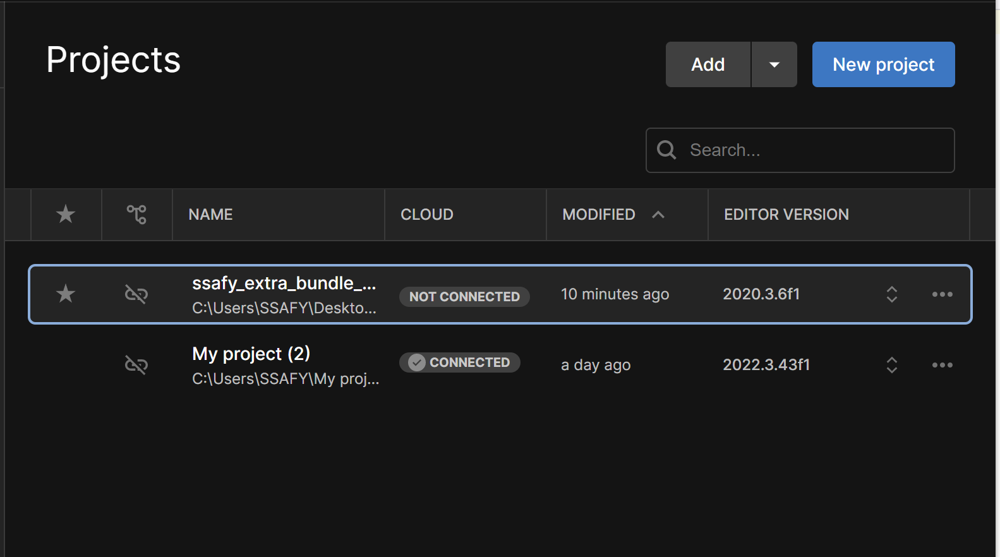
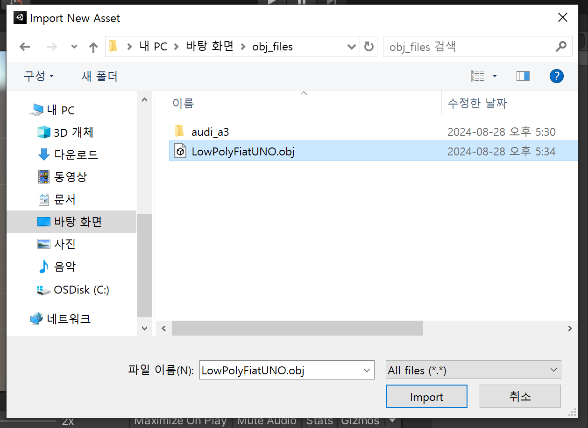
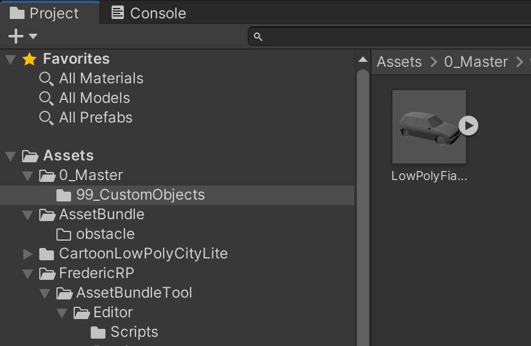

### Unity Hub

유니티는 3D 및 2D 비디오 게임의 개발 환경을 제공하는 게임 엔진이자, 3D 애니메이션과 건축 시각화, 가상현실 등 인터랙티브 콘텐츠 제작을 위한 통합 제작 도구.

### Version

2020.3.6f1 version 사용

###  Import Asset (Car)

Asset Store에서 원하는 Asset을 가져온다.
지하주차장의 환경세팅을 위한 주차되어 있는 차량을 구현해야함

예시로 자동차 obj파일을 가져온다.

Import -> Import New Asset

Import 확인

